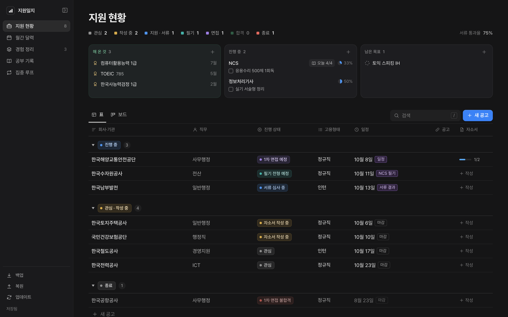
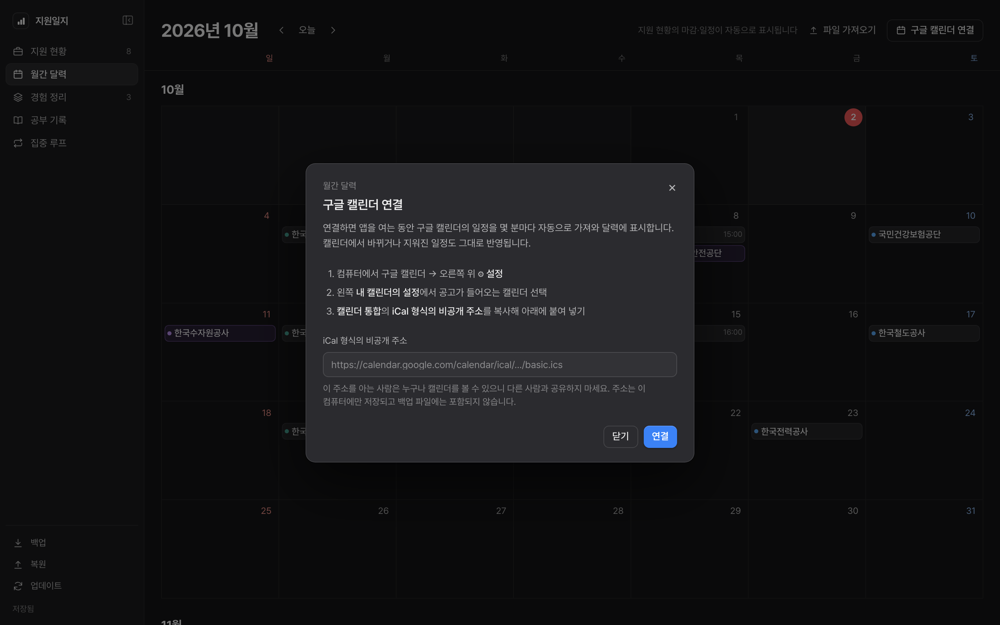
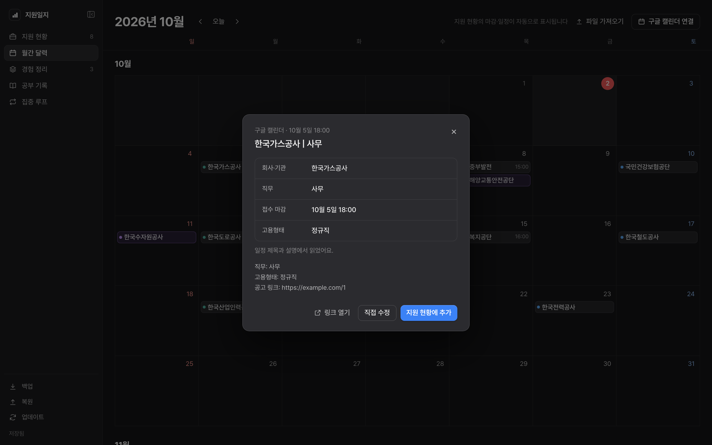
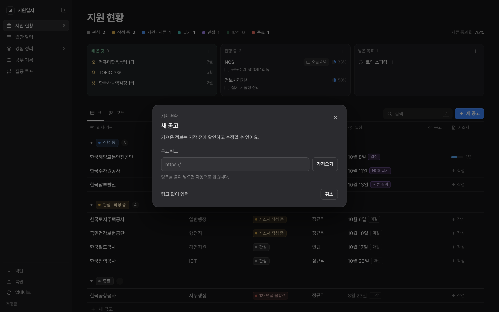
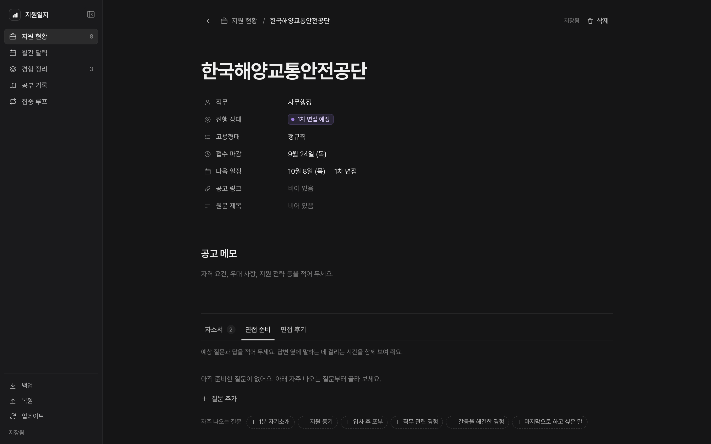
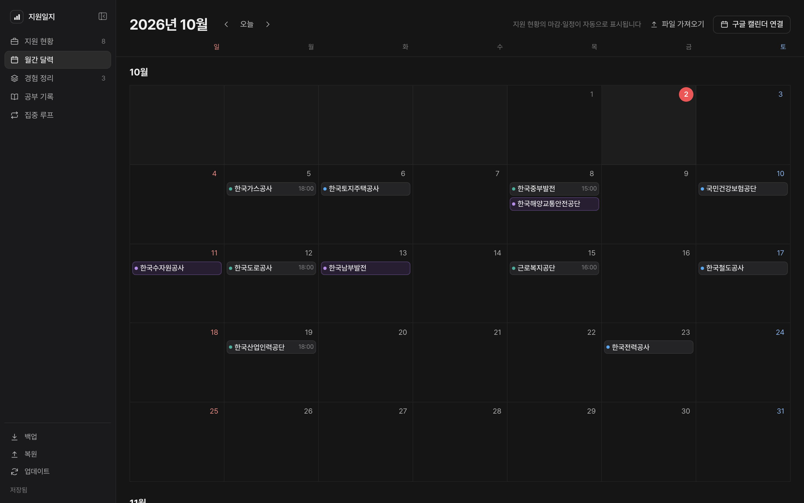
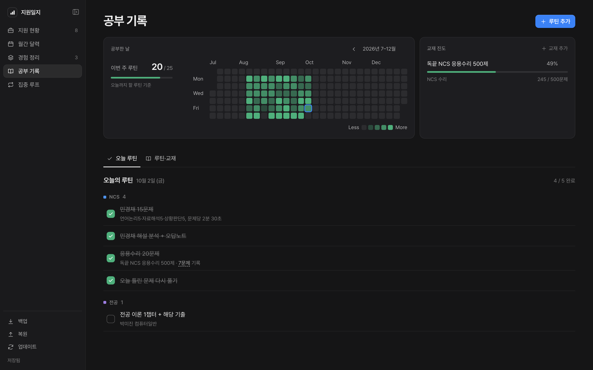
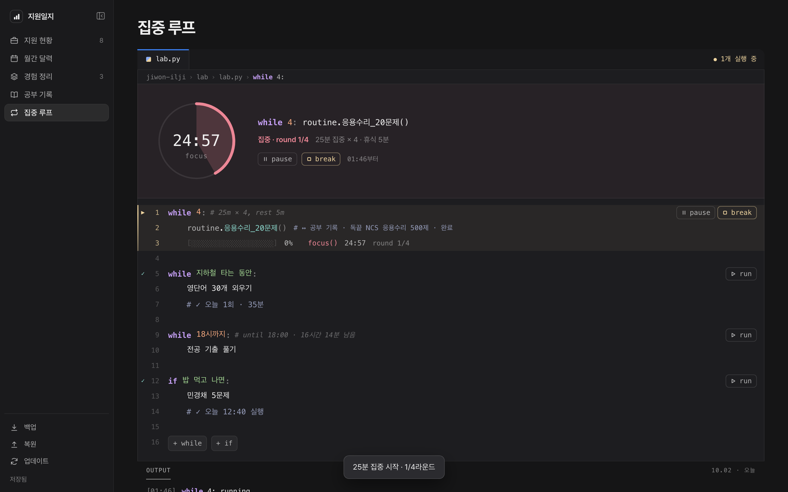

# 지원일지

취업 준비를 한곳에 모아 보는 **내 컴퓨터 전용** 기록 앱입니다.
공고 지원 현황, 자소서·면접 준비, 경험 정리, 공부 기록, 집중 타이머를 함께 씁니다.



- 기록은 내 컴퓨터의 `data` 폴더에만 저장되고, 어디에도 올라가지 않습니다.
- 윈도우와 맥에서 브라우저 없이 **자기 창**으로 열립니다.
- 새 버전은 앱 안의 **업데이트** 버튼으로 받습니다.

**목차**
[설치하기](#설치하기-처음-한-번) · [업데이트](#업데이트) · [공고를 구글 캘린더로 모으기](#시작-전에-공고를-구글-캘린더로-모으기) · [탭별 사용법](#탭별-사용법) · [기록과 백업](#내-기록과-백업) · [문제가 생기면](#문제가-생기면)

---

## 설치하기 (처음 한 번)

10분 정도 걸립니다. 설치 화면은 모두 **기본값 그대로 다음**을 누르면 됩니다.

### 윈도우

1. **Node.js 설치**: [nodejs.org](https://nodejs.org)에서 **LTS** 버전을 받아 설치합니다.
2. **Git 설치**: [git-scm.com/download/win](https://git-scm.com/download/win)에서 받아 설치합니다.
3. **앱 받기**
   1. 파일 탐색기에서 앱을 둘 폴더(예: `문서`)를 엽니다.
   2. 빈 곳을 **우클릭 → 터미널에서 열기**를 누릅니다.
      윈도우 10이라면 폴더 위쪽 주소창에 `powershell`을 입력하고 Enter를 누르면 됩니다.
   3. 아래 한 줄을 붙여 넣고 Enter를 누릅니다.
      ```
      git clone https://github.com/gguryuryu/jiwon-ilji.git
      ```
4. **아이콘 만들기**: 새로 생긴 `jiwon-ilji` 폴더에서 **`windows-app.bat`** 을 더블클릭합니다.
   바탕화면과 시작 메뉴에 지원일지 아이콘이 생깁니다.
5. **실행**: 아이콘을 누르면 지원일지 창이 열립니다. 작업 표시줄에 고정해 두면 편합니다.

> 처음 실행할 때 "Windows의 PC 보호" 창이 뜨면 **추가 정보 → 실행**을 누르세요. 서명하지 않은 개인 프로그램이라 한 번 뜹니다.

### 맥

1. **Node.js 설치**: [nodejs.org](https://nodejs.org)에서 **LTS** 버전을 받아 설치합니다.
2. **터미널 열기**: ⌘ Space를 눌러 `터미널`을 검색해 엽니다.
3. **앱 받기**: 아래 세 줄을 붙여 넣고 Enter를 누릅니다.
   ```
   cd ~/Documents
   git clone https://github.com/gguryuryu/jiwon-ilji.git
   open jiwon-ilji
   ```
   "명령어 라인 개발자 도구를 설치하겠습니까?" 창이 뜨면 **설치**를 누르세요. 설치가 끝나면 두 번째 줄부터 다시 붙여 넣습니다.
4. **실행**: 열린 폴더의 **`지원일지.app`** 을 Dock으로 끌어다 놓고 누릅니다.
   앱은 폴더 안에 그대로 두세요.

> "열 수 없다"는 창이 뜨면 **시스템 설정 → 개인정보 보호 및 보안 → 그래도 열기**를 한 번 누르세요.

<details>
<summary>Git 없이 ZIP으로 받아도 되나요?</summary>

됩니다. 저장소 페이지의 **Code → Download ZIP**으로 받아 압축을 풀어도 앱과 업데이트 버튼이 동작합니다.
다만 git clone으로 받는 쪽이 업데이트가 더 빠르고, 앱 파일을 실수로 고쳤을 때도 덮어쓰기 전에 알려 줘서 안전합니다.
</details>

---

## 업데이트

왼쪽 아래 **업데이트**를 누르고, 끝나면 **앱을 껐다 켜면** 새 버전이 적용됩니다.

- 작성 중인 내용은 업데이트 전에 먼저 저장되고, 내 기록(`data` 폴더)은 그대로 남습니다.
- 로그인은 필요 없습니다.
- 버튼 대신 앱 폴더에서 `git pull`을 실행해도 됩니다.

---

## 시작 전에: 공고를 구글 캘린더로 모으기

지원일지는 공고를 하나씩 입력하는 것보다, **구글 캘린더에 공고를 모아 두고 그중 지원할 것만 골라 담는** 방식이 훨씬 편합니다.
캘린더를 연결하면 공고가 달력에 저절로 뜨고, 눌러서 **지원 현황에 추가**만 하면 됩니다.

### 1. 공고 전용 캘린더 만들기

[구글 캘린더](https://calendar.google.com)를 컴퓨터에서 엽니다.
왼쪽 **다른 캘린더 +** → **새 캘린더 만들기**를 누르고, 이름을 `채용 공고`처럼 정해 만듭니다.

### 2. 캘린더에 공고 채우기

공고마다 **접수 마감일**에 일정을 하나씩 만듭니다. 아래 형식으로 넣으면 지원일지가 기관·직무·마감을 알아서 읽습니다.

```
제목: 한국전력공사 | 사무 (체험형 인턴)
날짜: 접수 마감일 (마감 시각이 있으면 그 시각)
설명:
직무: 사무
고용형태: 인턴
마감: 2026-10-02 18:00
공고 링크: https://…
```

`[회사] 직무`, `회사 - 직무` 같은 다른 제목 형식도 대부분 읽습니다.

**AI로 자동화하기 (추천)**
구글 캘린더에 일정을 만들 수 있는 AI 비서(예: 구글 캘린더를 연결한 Claude나 Gemini)에게 부탁하면, 공고를 찾아 캘린더에 넣는 일까지 맡길 수 있습니다.
반복 실행을 지원하는 도구라면 매일 아침 돌도록 예약해 두세요. 공고가 저절로 쌓입니다.

```
잡알리오(job.alio.go.kr)와 사람인에서 최근 3일 안에 올라온 채용 공고 중
[조건: 예) 공공기관 · 전산직 · 광주/전남 · 신입]에 맞는 것을 찾아 줘.
찾은 공고를 내 구글 캘린더의 '채용 공고' 캘린더에 접수 마감일 일정으로 넣어 줘.
이미 같은 공고가 있으면 넣지 마.
제목은 '기관명 | 직무', 설명에는 직무 / 고용형태 / 마감(YYYY-MM-DD HH:MM) / 공고 링크를 한 줄씩 적어 줘.
```

### 3. 캘린더 주소 복사하기

1. 구글 캘린더 오른쪽 위 ⚙ **설정**을 엽니다.
2. 왼쪽 **내 캘린더의 설정**에서 `채용 공고` 캘린더를 고릅니다.
3. **캘린더 통합**의 **iCal 형식의 비공개 주소**를 복사합니다.

> 이 주소를 아는 사람은 누구나 캘린더를 볼 수 있으니 다른 사람과 공유하지 마세요. 지원일지는 이 주소를 내 컴퓨터의 `data` 폴더에만 저장합니다.

### 4. 지원일지에 연결하기

**월간 달력 → 구글 캘린더 연결**을 누르고 복사한 주소를 붙여 넣은 뒤 **연결**을 누릅니다.



### 5. 지원할 공고 고르기

달력에 **초록 점**으로 뜬 공고를 누르면 기관·직무·마감이 정리되어 보입니다.
지원할 공고만 **지원 현황에 추가**를 누르세요. 누르지 않은 공고는 달력에만 남습니다.



- 앱이 켜져 있는 동안 몇 분마다 캘린더를 다시 읽습니다. 캘린더에서 마감일이 바뀌면 지원 현황에도 반영됩니다.
- 구글 쪽에서 비공개 주소에 반영되기까지 몇 분에서 몇 시간 걸릴 수 있습니다.
- 구글 캘린더 대신 `.ics` 파일이 있다면 **파일 가져오기**로 넣을 수도 있습니다.

---

## 탭별 사용법

### 지원 현황

지원한 공고를 진행 상태별로 묶어 봅니다. 맨 처음 화면입니다.

- **새 공고**: 공고 링크를 붙여 넣고 **가져오기**를 누르면 기관·직무·고용형태·마감일을 읽어 옵니다. 못 읽은 칸은 그 자리에서 고칩니다.
- **표 · 보드**: 표에서는 상태·직무를 바로 고치고, 보드에서는 카드를 끌어 상태를 바꿉니다. 기관 이름을 누르면 오른쪽에 상세가 열립니다.
- **목표 보드**(맨 위): 해 온 것 · 진행 중 · 남은 목표를 봅니다. 자격증·어학 점수도 여기에 쌓이고, 진행 중 목표의 할 일을 바로 체크합니다.
- 검색칸은 `/` 키로 바로 열 수 있습니다.



공고를 열면 아래에 **자소서 · 면접 준비 · 면접 후기** 탭이 있습니다.

- **자소서**: 문항별로 쓰고 글자 수(공백 포함·제외)를 봅니다. 문항에 경험 정리의 경험을 연결할 수 있습니다.
- **면접 준비**: 예상 질문과 답을 적으면 말하는 데 걸리는 시간이 보입니다. 자주 나오는 질문을 버튼 하나로 추가합니다.
- **면접 후기**: 받은 질문·분위기·아쉬운 점을 남기고, 받은 질문은 면접 준비로 옮깁니다.



### 월간 달력

공고 마감과 면접·결과 일정이 저절로 표시됩니다. 아래로 내리면 다음 달이 이어집니다.

- 🔵 접수 마감 · 🟣 면접·결과 일정 · 🟢 구글 캘린더에서 온 공고
- 일정을 누르면 창이 열리고, 거기서 **지원 기록 열기**로 공고로 가거나 캘린더 공고를 **지원 현황에 추가**합니다.


### 경험 정리

자소서와 면접에 쓸 경험을 미리 정리해 둡니다.

- 경험마다 유형·기간·역할·키워드·상세 내용을 적습니다. 상세 내용에는 `#` 제목, `-` 목록 서식을 쓸 수 있습니다.
- 위쪽 키워드를 누르면 그 키워드의 경험만 모아 봅니다.
- **쓴 공고** 칸에서 이 경험을 어느 공고의 자소서·면접에 썼는지 봅니다.



### 공부 기록

반복할 공부를 루틴으로 정하고 날마다 체크하면, 깃허브 잔디처럼 칸이 채워집니다.

- **루틴 추가**: 이름 · 구분(NCS · 전공 · 자격증, 직접 추가 가능) · 요일을 정합니다. 교재를 연결하면 체크할 때마다 진도가 쌓입니다.
- **오늘 루틴**에서 체크합니다. 칸 하나를 누르면 그날 기록을 보고 고칠 수 있습니다.
- 루틴 아래 **오늘만 할 일**에 그날 하루만 할 일을 적고 Enter를 누르면 추가됩니다. 루틴과 함께 잔디에 셉니다. 못 한 일은 **내일로**를 눌러 다음 날로 옮깁니다.
- 구분이 자격증인 루틴은 목표 보드의 자격증 목표와 이어집니다.
- 처음이라면 **전산직 필기 계획으로 시작**을 눌러 예시 루틴으로 시작하고 자유롭게 고치세요.



### 집중 루프

할 일을 파이썬 코드처럼 적고 ▷ **run**을 누르면 타이머가 돕니다. 위쪽 시계에서 남은 시간을 봅니다.
맨 아래 빈 줄에 `wh`·`i`만 쳐도 `while`·`if`가 자동 완성으로 뜨고, 고르면 새 블록이 생깁니다(`while 4:`처럼 끝까지 쳐서 Enter를 눌러도 됩니다).

| 이렇게 적으면 | 이렇게 돕니다 |
|---|---|
| `while 4:` | 25분 집중 × 4번 (사이 5분 휴식) 뽀모도로 |
| `while 50분 × 2:` | 50분 집중 × 2번 |
| `while 18시까지:` | 18시까지 남은 시간을 세다가 끝냄 |
| `while 지하철 타는 동안:` | break를 누를 때까지 걸린 시간을 잼 |
| `if 밥 먹고 나면:` | run을 누를 때마다 했다고 기록 |

- 실행문은 코드처럼 여러 줄로 적습니다. 줄 끝에서 Enter를 누르면 새 줄, 빈 줄 맨 앞에서 Backspace를 누르면 윗줄로 합쳐지고, ↑↓로 줄을 옮겨 다닙니다. `#`으로 시작하는 줄은 메모(주석)입니다.
- 집중과 휴식이 바뀔 때 소리와 알림이 나고, 다른 탭에 있어도 창 제목에 남은 시간이 보입니다.
- 실행문 줄 맨 앞에 `ro`·`go`만 쳐도 `routine.`·`goal.`이 뜨고, `routine.`이나 `goal.`을 치면 공부 기록 루틴·목표 할 일 목록이 뜹니다(코드 자동 완성처럼). 고르면 그 줄이 연결되어, 블록을 끝까지 마쳤을 때 그쪽에도 체크됩니다. 줄 옆 **↗ 연결**로 골라도 됩니다.
- **pause**로 잠시 멈추고, 다 했으면 **done**으로 블록을 치웁니다. 기록은 아래 OUTPUT에 남습니다.
- 여러 개를 함께 돌리면(예: `18시까지` 안에서 뽀모도로) 위쪽에 시계 두 개가 나란히 보입니다.
- 맥·윈도우 앱에서는 **⧉ 작은 창**을 누르면 다른 앱 위에 늘 떠 있는 작은 타이머 창이 열립니다. 거기서 바로 pause·break할 수 있고, 시간을 누르면 지원일지 창이 열립니다.



---

## 내 기록과 백업

- 기록은 `data/job-search.json`에 자동 저장됩니다. 이 폴더는 GitHub에 절대 올라가지 않습니다.
- 왼쪽 아래 **백업 · 복원 → 백업 파일 저장**을 누르면 기록 전체가 파일 하나로 저장되고, **백업에서 복원**으로 되돌릴 수 있습니다. 가끔 백업해 두세요.
- 처음에는 비어 있습니다. 지원 현황의 **예시 살펴보기**로 예시 공고를 넣어 볼 수 있고, 언제든 지울 수 있습니다.

## 문제가 생기면

| 증상 | 해결 |
|---|---|
| 왼쪽 아래에 **저장 오류**가 뜸 | 앱 창은 닫지 말고 지원일지 아이콘을 다시 눌러 켜세요. 다시 켜지면 밀린 내용이 저장됩니다. |
| 업데이트가 실패함 | 화면에 뜬 문구를 확인하세요. 그래도 안 되면 앱 폴더에서 `git pull`을 실행하세요. |
| 바로가기 아이콘이 예전 모양 | 윈도우는 `windows-app.bat`을 한 번 다시 실행하세요. |
| "4173번 포트" 안내가 뜸 | 다른 프로그램이 같은 포트를 쓰고 있습니다. 그 프로그램을 끄고 다시 켜세요. |
| 앱이 켜지지 않음 | 기록 파일을 확인하세요. 윈도우는 `%LOCALAPPDATA%\jiwon-ilji\server.log`, 맥은 `~/Library/Logs/jiwon-ilji.log`입니다. |

- 로그인이 필요하거나 화면을 자바스크립트로 그리는 공고 사이트는 일부 항목을 직접 입력해야 합니다.
- 앱 주소는 `http://127.0.0.1:4173`입니다. 앱이 켜져 있을 때 브라우저로도 열 수 있습니다.

---

<details>
<summary><b>개발 메모</b></summary>

```
server.mjs          앱 서버: 파일 저장(판 번호로 충돌 방지), 공고 링크 읽기, 구글 캘린더 가져오기
lib/parse.mjs       공고 페이지·캘린더 일정에서 회사·직무·마감일을 읽는 함수(네트워크 없음)
lib/update.mjs      업데이트 버튼: Git으로 받은 폴더는 git, 아니면 GitHub 압축 파일
index.html          화면 틀과 창(새 공고, 일정, 캘린더 연결)
style.css           스타일. 폭별 규칙(@media)은 파일 끝에 넓은 화면 → 좁은 화면 순서로 둔다
js/main.js          시작점: 공통 이벤트 연결, 데이터 불러오기
js/state.js         데이터와 현재 화면(다른 파일은 setData, setRoute로만 바꾼다)
js/store.js         저장·재시도·다른 창과 맞추기, merge.js는 충돌 때 변경 합치기
js/router.js        주소(#/…)와 화면 이동, 뒤로 가기
js/goals.js         지원 현황 위의 목표 · 해 온 것 보드, 목표 창, 자격 창
js/postings.js      지원 현황(표·보드·단계 요약), posting-detail.js 상세, interview.js 면접 후기, peek.js 사이드 피크, date-field.js 날짜 칸
js/lab.js           집중 루프(while·if 블록), 계산은 lab-model.js
js/study.js         공부 기록(잔디·루틴·교재 진도), 계산은 study-model.js
js/experiences.js   경험 정리, calendar.js·ics.js·event-dialog.js 달력, posting-dialog.js 새 공고 창
js/util.js, model.js, ui.js, dom.js   공통 도구, 상태 규칙, 알림·움직임, 자주 쓰는 화면 요소
지원일지.app        맥 앱(WKWebView 창). 소스는 mac/main.swift, 다시 만들 때는 mac/build.command(아이콘도 함께)
windows/            윈도우 전용 창(src: WebView2 프로그램 소스, app: 빌드된 jiwon-ilji.exe). 빌드는 .github/workflows/windows-app.yml
windows-app.bat     윈도우 바로가기 만들기. start.bat · start.command는 아이콘 없이 실행
assets/             아이콘(icon.svg 원본, icon-transparent.ico), 예전 윈도우 실행기(launch-windows.vbs), 바로가기 만들기(make-shortcut.ps1)
docs/images/        README 화면(예시 데이터로 찍음)
fonts/              Pretendard 글꼴(SIL Open Font License, fonts/OFL.txt)
test/               자동 테스트(서버를 실제로 띄워 보는 테스트 포함)
```

테스트는 `npm test`로 돌립니다(설치할 패키지 없음). GitHub에 올릴 때마다 윈도우·맥·리눅스에서 자동으로 돌아갑니다.
</details>
